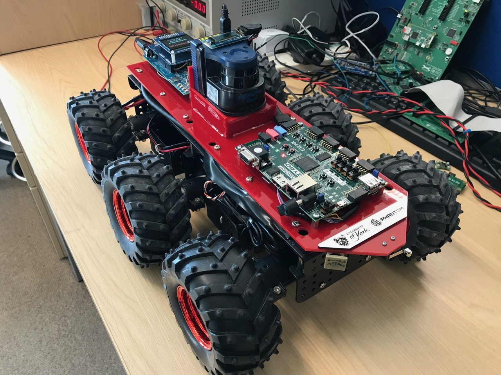
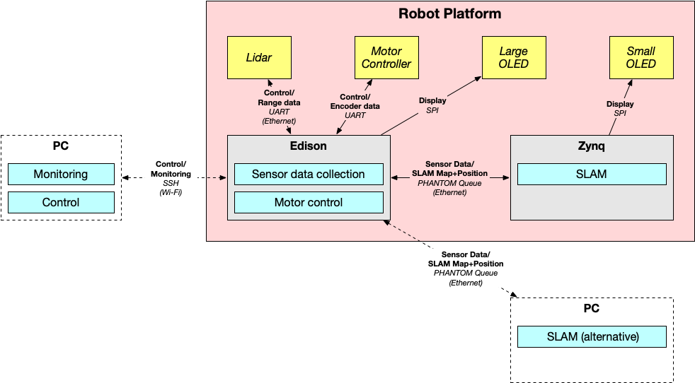

# PHANTOM Autonomous Vehicle Demonstrator Platform

The PHANTOM autonomous vehicle platform was developed to allow components to be deployed across a heterogeneous embedded robotics platform, while optimising for requirements such as power use.
The platform contains a lidar for  an Intel Edison for low-power processing, a Zynq-7000 SoC for higher-power and FPGA processing.

## Robot Platform

The autonomous vehicle platform is comprised of the following components.

**Compute Platforms**
- [Intel Edison Board for Arduino](https://www.intel.com/content/www/us/en/support/products/84574/boards-and-kits/intel-edison-boards/intel-edison-board-for-arduino.html)
- [Digilent Zybo Board](https://reference.digilentinc.com/reference/programmable-logic/zybo/start)

**Mechanical/Electrical**
- [Dagu Wild Thumper 6WD Robot Chassis](https://robosavvy.com/store/dagu-wild-thumper-6wd-black-w-wheel-encoders-75-1-gearboxes.html)
	- 75:1 gearboxes
	- With quadrature wheel encoders
- [DAGU Wild Thumper High Power Switch](https://robosavvy.com/store/dagu-wild-thumper-high-power-switch.html)
- [RoboClaw 2x15A Motor Controller](https://www.basicmicro.com/RoboClaw-2x15A-Motor-Controller_p_10.html)
- [Turnigy 5000mAh 2S 7.4V 60C Battery](https://hobbyking.com/en_us/turnigy-5000mah-2s-7-4v-60c-hardcase-pack-roar-approved.html)
- [UBG-04LX-F01 Scanning Rangefinder (Lidar)](https://www.hokuyo-aut.jp/search/single.php?serial=164)

**Additional Components**
- [Digilent Pmod OLED Display](https://reference.digilentinc.com/reference/pmod/pmodoled/reference-manual)
- [NHD-1.69-AU-SHIELD Colour OLED Display](https://www.newhavendisplay.com/nhd169aushield-p-9482.html)

## SLAM Algorithm

The robot performs Simultaneous Localisation and Mapping (SLAM) on the Zynq board, using an algorithm based on [tinySLAM/CoreSLAM](https://openslam-org.github.io/tinyslam.html).

## PHANTOM Demonstrator

The PHANTOM demonstrator application maps components for motor control, sensor data collection and SLAM processing between the Edison and Zynq in order to optimise for power use.

Data collection and motor control are mapped to the low-power Edison, which runs continuously, and the SLAM algorithm is run on the higher-power Zynq in bursts when required.

## Video Demonstration

